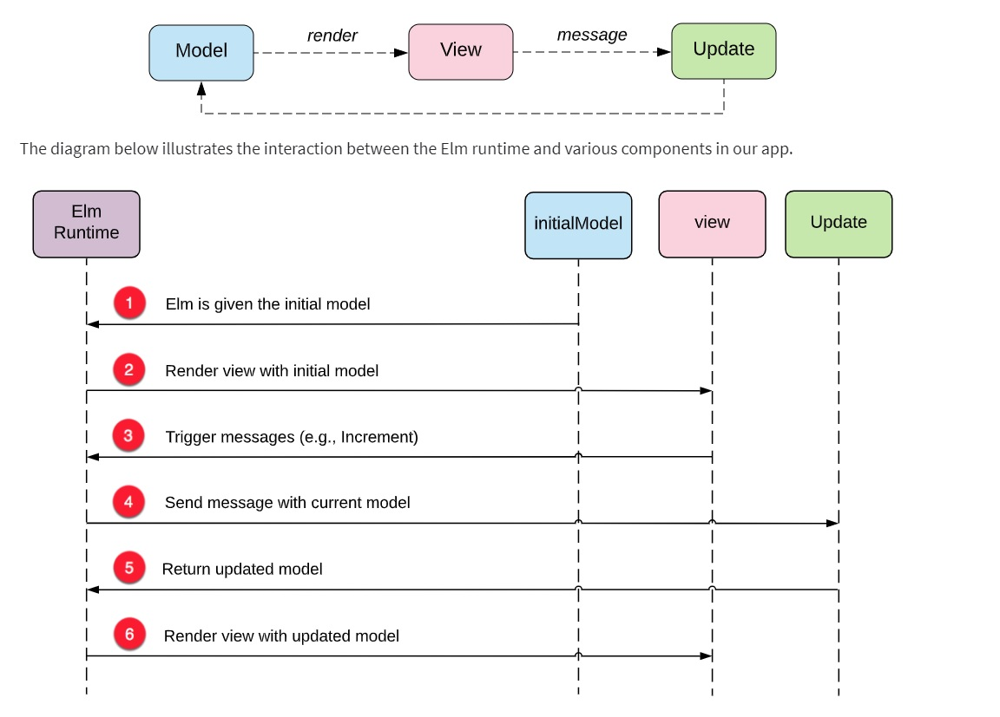

[**HOME**](../index.md)

[Functional Programming Paradigm](https://www.geeksforgeeks.org/functional-programming-paradigm/)

## Explain the functional programming paradigm
  
* ### Concepts of functional programming:
    * **Pure functions**
        * These functions have two main properties. 
          * First, they always produce the same output for same arguments irrespective of anything else.
          * Secondly, they have no side-effects i.e. they do modify any argument or global variables or output something.
        * The pure functions only result is the value it returns.
        * Programs done using functional programming are easy to debug.
        
              sum(x, y)           // sum is function taking x and y as arguments
                return x + y    // sum is returning sum of x and y without changing them
                
    * **Recursion**
        * There are no “for” or “while” loop in functional languages. Iteration in functional languages is implemented through                     recursion. Recursive functions repeatedly call themselves, until it reaches the base case.
    * **Referential transparency**
        * State of any variable is constant at any instant.
        * If we have to store some value, we define new variables instead. 
        
                    x = x + 1 // this changes the value assigned to the variable x.
                      // So the expression is not referentially transparent. 
                      
    * **Functions are First-Class and can be Higher-Order**
        * First-class functions are functions that can be treated like any other value. You can pass them to functions as arguments,               return them from functions, and save them in variables. 
        * A higher order function is a function that takes a function as an argument, or returns a function. Higher order function is in           contrast to first order functions, which don’t take a function as an argument or return a function as output.
    * **Variables are Immutable**
        * In functional programming, we can’t modify a variable after it’s been initialized. We can create new variables, but we can’t               modify existing variables, and this really helps to maintain state throughout the runtime of a program. Once we create a variable           and set its value, we can have full confidence knowing that the value of that variable will never change.

## Pros and Cons Elm vs. Javascript**
  
  Elm | JavaScript
  ----|----------
  **Pros** | **Pros**
  Code stays clean | Can be used on frontend/backend
  Great type system | It's everywhere
  No Runtime Exceptions | Lots of great frameworks
  Render extremely fast | Also used in example node.js or Apache
  Well-architected code | Supports object-oriented, imperative, and functional programming styles.
  Friendly compiler messages |
  Type safety |
  If it compiles, it runs |
  **Cons** | **Cons**
           | Horribly inconsistent
           | Browser Support
           | Single Inheritance
  

### Elm architecture**

